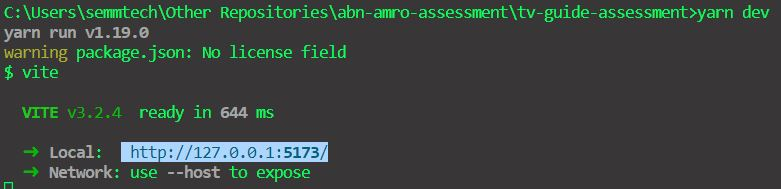

# Introduction
This is my first VueJs hands-on experience. A sample to demonstrate my learnability and turn around time of my productivity. 

In a short period of time (~18 hours), I managed to create a application to fullfill the basic  requirements. But time won in the end when started to implement error handling and unit-tests.

## Process
### Thought process
My inspiration for this application was Netflix. 

Firstly, I needed to figure out what technologies to complement with the requirement that the stack should have VueJS. This was easy as Vue has a [scaffolding](https://vuejs.org/guide/quick-start.html#creating-a-vue-application). They also guide you to have proper IDE setup (VSCode).

Next step was to read the VueJS documentation to gain some knowledge which took some time. As a side effect, I decided to have a basic storage as I did not want to spend too much time investigating.

Then the routing and basic component came into existence. The critical part was to come up with the algorithm to show the number of TV Show posters in a page. And it should be responsive.

Due to my familiarity with Material UI, I decided to use Vuetify in the application. Although I did add basic html and css at some places due to time constraint.

At last, unit testing, I used Cypress as it came inbuilt as is a powerful tool.

### Development process
The application was bootstrapped with 
```sh
npm init vue@latest
```
It would setup the application all the configuration for Vue3, Vue Router, Typescript, Cypress, ESLint and Prettier.

Next thing was to set up the base services and storage files followed by components.

I dealt initially with Home Page then the details page. At last I incorporated  the search functionality.

After the implementation, what all left was a lot of cleaning up. Simultaneously this README was being written. 

In the end, so unit test for garnishing.

## TV Guide Assessment functionalities
1. Display all TV Shows categorized by genres.
2. Search a TV Show.
3. Display details of a TV Show.

## Project Setup
### Technologies 
[Vue 3](https://vuejs.org/guide/quick-start.html) + [Typescript](https://www.typescriptlang.org/) +  [Vite](https://vitejs.dev/) + [Vuetify](https://next.vuetifyjs.com/en/) +[Cypress](https://www.cypress.io/)

### Install dependencies
```sh
npm install # or `yarn`
```

### Run the application
```sh
npm run dev # or `yarn dev`
```
The application should be available at http://127.0.0.1:5173/, if the path does not work (mostly because port is busy) then one can find the path in the logs.




### Type-Check, Compile and Minify for Production
```sh
npm run build # `yarn build`
```

## Testing
### Run Headed Component Tests with [Cypress Component Testing](https://on.cypress.io/component)
```sh
npm run test:unit # or `yarn test:unit`
```

### Run End-to-End Tests with [Cypress](https://www.cypress.io/)
```sh
npm run build # or yarn build
npm run test:e2e # or yarn test:e2e
```

### Lint with [ESLint](https://eslint.org/)
```sh
npm run lint # or yarn lint
```

## Future Improvements
1. Add more e2e and unit tests. Increase coverage to at-least 80%.
2. Improve error handling. And show a notification when an error occurs (infrastructure for a notifications is present [vue3-notification](https://github.com/kyvg/vue3-notification).
3. Add a store for caching and prevent frequent API calls.
4. Create a UI theme.
